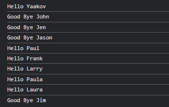

# Module_4_Coding_Assignment
Module 4 Coding Assignment / Johns Hopkins University Web Development

https://ramirezjm.github.io/Module_4_Coding_Assignment/

The idea of this assignment is to take an existing array of names
and then output either Hello 'Name' or Good Bye 'Name' to the console.
The program should say "Hello" to any name except names that start with a "J"
or "j", otherwise, the program should say "Good Bye".

